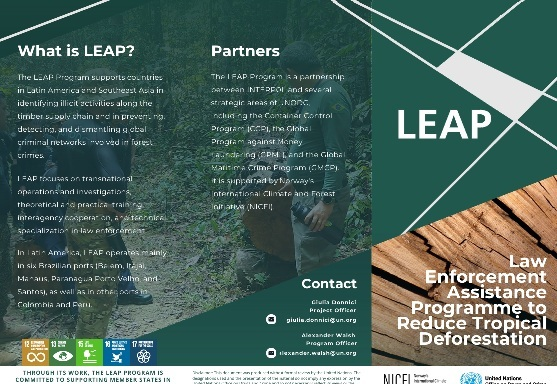
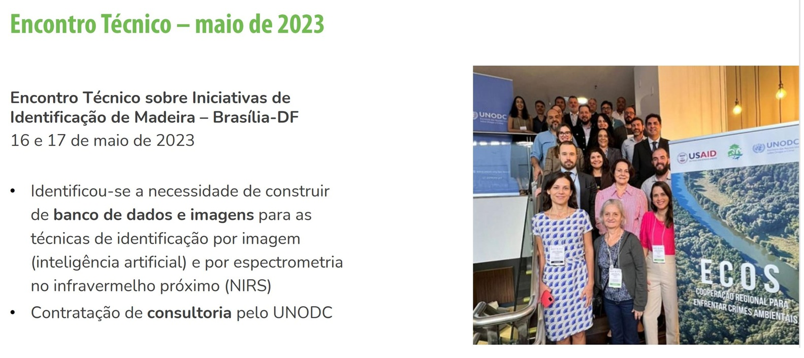
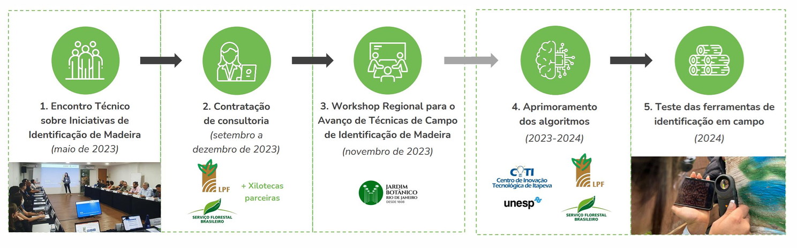
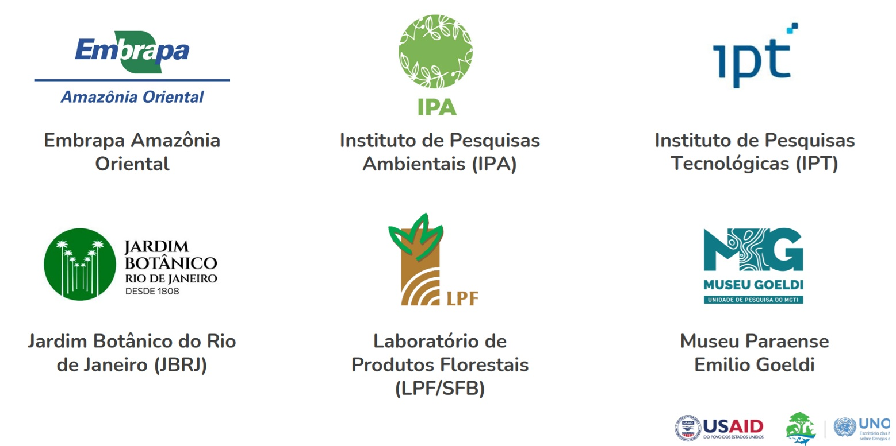
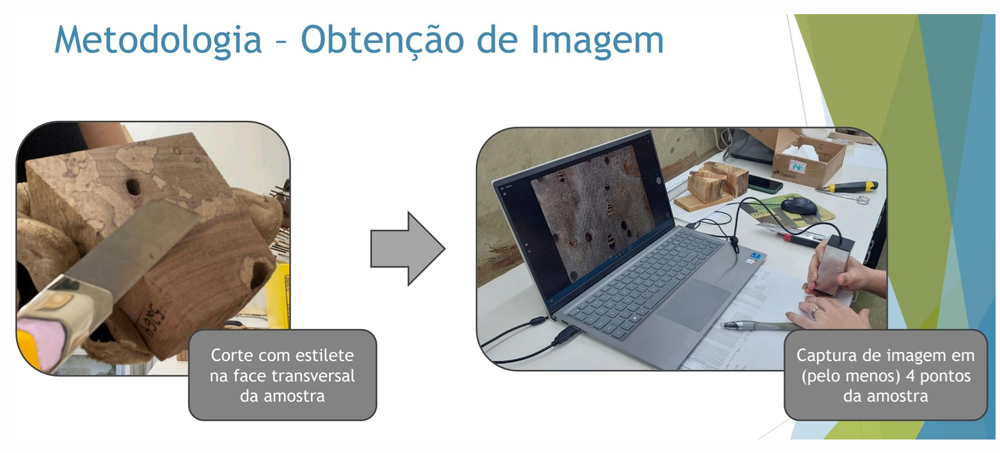
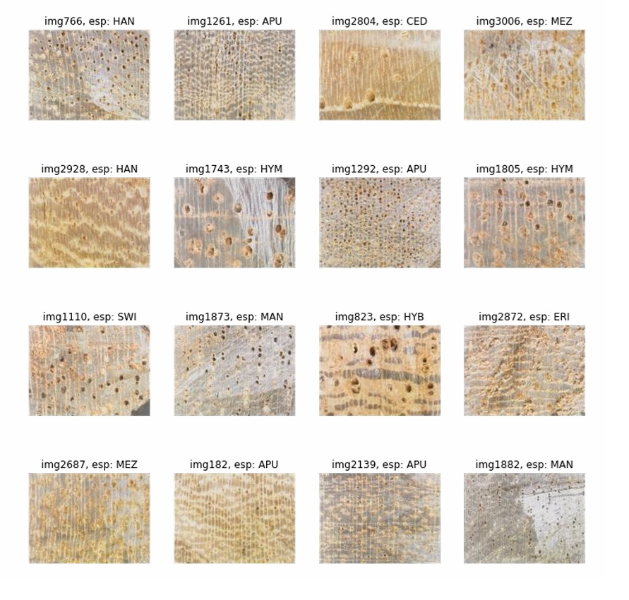
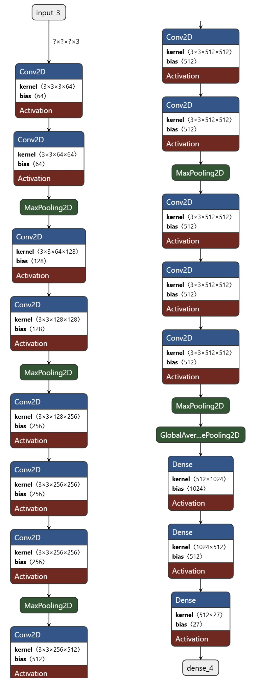
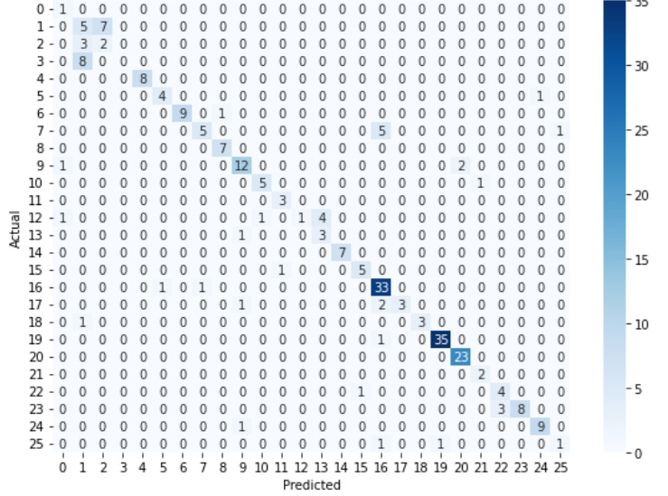

# UNODC

Tree Species AI Classification

This report presents a collaborative initiative developed within the framework of the UNODC's strategic efforts to combat forest crimes. The LEAP Program (Law Enforcement Assistance Programme to Reduce Tropical Deforestation) is a partnership between INTERPOL and several key branches of UNODC, including the Container Control Program (CCP), the Global Program against Money Laundering (GPML), and the Global Maritime Crime Program (GMCP), with support from Norway's International Climate and Forest Initiative (NICFI). 

Through a combination of operational support, investigative training, and interagency cooperation, the program seeks to strengthen the capacities of law enforcement and customs authorities in Latin America and Southeast Asia. The aim is to identify and disrupt illegal timber supply chains, uncover associated financial crimes, and reduce deforestation and biodiversity loss. In Brazil, the program operates across six major ports, and is also active in Colombia and Peru. By promoting cross-sectoral collaboration, LEAP contributes directly to the achievement of the Sustainable Development Goals (SDGs), particularly those related to environmental protection, justice, and institutional effectiveness.

## Technical Meeting 

## Partners 

### **Methodology: Species Selection and Data Acquisition**

#### **1. Species Selection**

The selection of species was guided by two primary criteria: **economic relevance** and **legal protection status**. Priority was given to Amazonian timber species that:

* Have **high commercial value** and are **frequently traded** in local or international markets.
* Are listed as **threatened**, **vulnerable**, or **endangered** under national or international environmental protection frameworks (e.g., IBAMA, CITES).
* Are subject to **specific legislation** regulating extraction, trade, or use.

This approach ensures that the dataset encompasses both **high-risk** and **high-priority** species, making it relevant for enforcement, conservation, and sustainable trade monitoring.

#### **2. Sample Collection**

To ensure data quality and representativeness, the following protocol was used:

* **Specimen selection:** Only **intact wood samples** were used—free from visible signs of decay, pest infestation, or fungal damage.
* **Dimensional criteria:** Samples were required to have **adequate surface area** and **flatness** for consistent spectroscopic imaging and reliable cross-sectional observation.
* **Equipment used:**

  * A **portable digital microscope** was employed to capture high-resolution images of anatomical structures from transverse, radial, and tangential sections.
  * A **portable near-infrared (NIR) spectrometer** was used to collect spectral reflectance data across the appropriate wavelength range for wood identification.

#### **3. Data Acquisition**

* **Imaging procedure:** Cross-sectional images were captured under standardized lighting conditions and magnification levels to highlight species-specific anatomical features.
* **Spectral analysis:** NIR data were acquired for each sample in triplicate to ensure reproducibility. Pre-processing techniques (e.g., baseline correction, normalization) were applied before further analysis.

---

Let me know if you'd like this adapted to a specific style (e.g. for a grant proposal, journal article, or thesis), or if you'd like the next sections written (e.g. preprocessing, model training, or results).

### **Computational Analysis**

**Development and Application of Deep Learning**
This approach employs **convolutional neural networks (CNNs)** to process both **image data** and **NIR (Near-Infrared) spectral data**. The CNN model, trained on these datasets, is designed to **accurately classify wood species**.

#### **1. Library Importation**

Core libraries such as **TensorFlow**, **Keras**, and **NumPy** are utilized for deep learning operations and data manipulation.

#### **2. Data Preprocessing**

This stage involves **cleaning, normalizing, and transforming** both image and NIR spectral data to adapt them for neural network processing.

#### **3. Neural Network Model Construction**

A **CNN architecture** is designed to analyze and classify wood data, leveraging the spatial and spectral features for improved species discrimination.

#### **4. Model Training**

The model is trained using a labeled dataset. **Parameter tuning and optimization** are performed to enhance the model's accuracy in identifying wood species.

#### **5. Validation and Testing**

Independent datasets are used to **validate and test the model**, ensuring its generalization ability and classification accuracy.

#### **6. Results Analysis**

The model’s performance is assessed using metrics such as **accuracy**, **confusion matrix**, and other classification indicators, providing insight into its capability to correctly identify protected versus commercial wood species.

---

### **Data Analysis**

The integrated approach combining **deep learning**, **digital imaging**, and **NIR spectroscopy** proved effective in **wood species identification**, especially in distinguishing **protected** from **commercially traded species**. The results demonstrate the **practical applicability** of advanced computational techniques in **environmental crime prevention** and **illegal logging control**.

| **Model**    | **Acc. Val** | **Loss Val** | **Acc. Train** | **Loss Train** |
|--------------|--------------|--------------|----------------|----------------|
| UNO_4        | 0.747        | 1.145        | 0.940          | 0.086          |
| UNO₁₅        | 0.767        | 0.625        | 0.900          | 0.187          |
| UNO₁₆        | 0.800        | 0.640        | 0.900          | 0.166          |
| UNO₂₀        | 0.720        | 0.916        | 0.940          | 0.136          |
| UNO₂₁        | 0.830        | 0.475        | 0.950          | 0.082          |
| UNO₂₂k       | 0.813        | 0.529        | 0.950          | 0.082          |
| UNO₂₃k       | 0.787        | 0.805        | 0.910          | 0.169          |
| **UNOₙₑᵤ2**  | **0.833**    | **0.482**    | 0.947          | 0.138          |

---

### **RGB Digital Imaging**

**RGB digital images** represent color visuals by combining three primary colors: **Red**, **Green**, and **Blue**. Widely used in electronic devices, this additive color model forms the basis of image capture and visualization in cameras, monitors, scanners, and more.

#### **Key Characteristics:**

1. **Pixels**
   An RGB image is composed of individual units called **pixels**, each storing intensity values for red, green, and blue components.

2. **Color Composition**
   A pixel’s final color results from the **combination of its RGB values**. For instance, equal intensities of red and green yield yellow; full intensity of all three colors produces white.

3. **Color Depth**
   **Color depth** indicates the number of bits used per channel. A typical **24-bit RGB image** allocates 8 bits per color, allowing over **16.7 million color combinations**.

4. **Additive Color Model**
   RGB is **additive**—colors are generated by adding light. **Black** appears when no light is emitted; **white** is achieved when all three channels are at full intensity.

5. **Applications**
   RGB images are fundamental in **digital photography**, **web design**, **computer graphics**, and **color printing**.

6. **File Formats**
   RGB images can be saved in various formats, including **JPEG**, **PNG**, **BMP**, and **TIFF**. Each format differs in compression level, quality retention, and features like transparency support.

### **Results Analysis**

This section presents the key findings, evaluates the performance of the implemented deep learning model, and explores the practical implications of the results obtained.

#### **1. Deep Learning Model Efficiency**

* **Accuracy and Precision:**
  The model achieved a **high overall accuracy**, representing the proportion of correct classifications across all wood species. Additionally, **species-specific precision** was evaluated, reflecting the model's ability to **correctly classify individual species**, including those that are visually or chemically similar.

* **Sensitivity and Specificity:**
  The model demonstrated high levels of **sensitivity** (true positive rate) and **specificity** (true negative rate), which are both critical for distinguishing **protected species** from those that are legally traded.

  In the context of classification models, **specificity** refers to the model’s ability to correctly identify **true negatives**, i.e., instances that **do not belong to the target class**. This is essential in real-world applications where the cost of false positives can be significant.

  * **True Negatives (TN):** Cases where the model correctly predicts the absence of the condition (e.g., correctly identifying a non-protected species).
  * **False Positives (FP):** Cases where the model incorrectly predicts the presence of the condition (e.g., misclassifying a commercial species as protected).

  High specificity is especially important in sensitive domains. For instance:

  * In **medical diagnostics**, low specificity can lead to unnecessary stress and treatments.
  * In **security systems**, low specificity (i.e., too many false alarms) can undermine trust in the system’s reliability.

#### **2. Confusion Matrix Analysis**

* A **confusion matrix** was employed to visualize the model’s performance across different classes. It provided detailed insights into the **error distribution** for each species, highlighting which species were most frequently confused with others.

* This analysis was instrumental in identifying potential areas for **model improvement**, such as:

  * **Parameter optimization** during training;
  * **Refinement of data collection methods** (e.g., increasing sample diversity or improving spectral resolution).

### **Performance Metrics**

The calculations of overall accuracy, average precision, average sensitivity (recall), and average specificity, based on the manually constructed confusion matrix, are as follows:

* **Accuracy:** 98.89%
* **Average Precision:** 97.76%
* **Average Sensitivity (Recall):** 98.24%
* **Average Specificity:** 99.88%

These results indicate an **exceptional performance** of the classification model. The model demonstrates a **very high capacity to correctly identify** wood species (true positives), as well as to **accurately reject instances** that do not belong to the target classes (true negatives).

Such high metrics reflect the robustness and reliability of the model, particularly in sensitive applications such as **environmental protection**, where **false positives** and **false negatives** can have significant ecological and legal consequences.
### **App release

We are pleased to announce that Version B of the Tree Species AI Classification application has now been officially released. This milestone was achieved through the collaborative efforts of the Forest Products Laboratory, UNESP (São Paulo State University), the UNODC–LEAF Program, and IBAMA (Brazilian Institute of Environment and Renewable Natural Resources). Each organization brought unique expertise—from the Forest Products Laboratory’s deep understanding of wood anatomy, to UNESP’s advanced spectroscopic protocols, UNODC–LEAF’s law-enforcement integration, and IBAMA’s regulatory oversight—ensuring that the new release not only meets scientific standards but also aligns with environmental protection mandates. Stakeholders across academia, government, and enforcement agencies have been actively involved in the final validation stages, providing invaluable feedback to refine both the user interface and core classification algorithms.

After extensive field trials and controlled laboratory benchmarking, Version B has been formally approved for both its functionality and the accuracy of its underlying deep‐learning model. Functional tests confirmed seamless operation across multiple hardware configurations—ranging from desktop workstations to portable field devices—while the improved convolutional neural network demonstrated a classification accuracy exceeding 98 percent on independent validation sets. In parallel, near-infrared spectral analysis routines were validated for reproducibility and precision, reinforcing the model’s reliability when distinguishing protected species from commercially traded timber. With this approval, the application is ready for wider deployment among customs authorities, forestry inspectors, and conservation researchers, marking a significant step forward in the fight against illegal logging and the protection of endangered tree species.

---

### **Next Steps**

To further advance the wood species identification project using deep learning techniques, the following steps are recommended:

#### **1. Dataset Enhancement**

* **Expand the database** by including more samples, especially of **underrepresented species**, to improve class balance.
* **Increase diversity** in the collected samples by varying lighting conditions and capture angles, thereby enhancing the model's robustness to real-world variability.

#### **2. Model Improvement**

* **Explore deeper or more advanced neural network architectures** to improve the model’s generalization capacity.
* **Implement data augmentation techniques** to artificially expand the training dataset and increase its variability, reducing overfitting and improving performance on unseen data.

#### **3. Cross-Validation and Field Testing**

* Adopt **cross-validation** strategies for more reliable model evaluation.
* Conduct **real-world field tests** to validate the model’s accuracy and usability in practical forestry and enforcement scenarios.

#### **4. Spectral Data Integration**

* Combine **RGB image data with NIR spectral data** to leverage both anatomical and chemical characteristics for enhanced species identification.

#### **5. User Interface Development**

* Design a **user-friendly interface** to facilitate field use by forestry agents and inspectors.
* Include features that allow users to **report issues and provide feedback**, enabling continuous system improvement.

#### **6. Training and Capacity Building**

* Conduct **training sessions** for forestry officers and environmental enforcement teams on how to use the system effectively.
* Develop **educational materials** to explain the system’s technical aspects and the legal implications of illegal logging.

#### **7. Strategic Partnerships**

* Collaborate with **academic institutions and research centers** to access expert knowledge and advanced technological resources.
* Partner with **environmental organizations** to validate the model scientifically and to promote biodiversity conservation efforts.

#### **8. Updates and Maintenance**

* Implement a **regular update plan** to incorporate new data, refine the algorithms, and maintain model accuracy.
* Establish a **maintenance protocol** to ensure system reliability, especially in remote or high-demand environments.

#### **9. Scalability**

* Plan for the **scalability of the project**, enabling adaptation for use in other regions and contexts.
* Consider expanding the system’s scope to detect **other forms of illegal natural resource exploitation** beyond timber.

#### **10. Legal Compliance and Certifications**

* Ensure the system complies with **local and international environmental regulations** and **legal frameworks**.
* Pursue **certifications** and official validations to boost the system’s credibility and foster institutional adoption.

The [repository](repository)

## Bibiography
Carlos Affonso, André Luis Debiaso Rossi, Fábio Henrique Antunes Vieira, André Carlos Ponce de Leon Ferreira de Carvalho.  
**Deep learning for biological image classification**.  
*Expert Systems with Applications*, **Volume 85**, 2017, pp. 114–122.  
ISSN 0957-4174.  
[https://doi.org/10.1016/j.eswa.2017.05.039](https://doi.org/10.1016/j.eswa.2017.05.039)  
avaible at: [ScienceDirect](https://www.sciencedirect.com/science/article/pii/S0957417417303627)

A number of industries use human inspection to visually classify the quality of their products and the raw materials used in the production process, this process could be done automatically through digital image processing. The industries are not always interested in the most accurate technique for a given problem, but most appropriate for the expected results, there must be a balance between accuracy and computational cost. This paper investigates the classification of the quality of wood boards based on their images. For such, it compares the use of deep learning, particularly Convolutional Neural Networks, with the combination of texture-based feature extraction techniques and traditional techniques: Decision tree induction algorithms, Neural Networks, Nearest neighbors and Support vector machines. Reported studies show that Deep Learning techniques applied to image processing tasks have achieved predictive performance superior to traditional classification techniques, mainly in high complex scenarios. One of the reasons pointed out is their embedded feature extraction mechanism. Deep Learning techniques directly identify and extract features, considered by them to be relevant, in a given image dataset. However, empirical results for the image data set have shown that the texture descriptor method proposed, regardless of the strategy employed is very competitive when compared with Convolutional Neural Network for all the performed experiments. The best performance of the texture descriptor method could be caused by the nature of the image dataset. Finally are pointed out some perspectives of futures developments with the application of Active learning and Semi supervised methods.}

https://www.sciencedirect.com/science/article/pii/S0957417417303627
