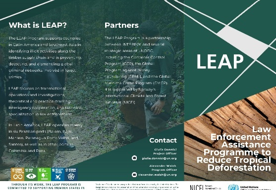

# UNODC

Tree Species AI Classification

This report presents a collaborative initiative developed within the framework of the UNODC's strategic efforts to combat forest crimes. The LEAP Program (Law Enforcement Assistance Programme to Reduce Tropical Deforestation) is a partnership between INTERPOL and several key branches of UNODC, including the Container Control Program (CCP), the Global Program against Money Laundering (GPML), and the Global Maritime Crime Program (GMCP), with support from Norway's International Climate and Forest Initiative (NICFI). 

Through a combination of operational support, investigative training, and interagency cooperation, the program seeks to strengthen the capacities of law enforcement and customs authorities in Latin America and Southeast Asia. The aim is to identify and disrupt illegal timber supply chains, uncover associated financial crimes, and reduce deforestation and biodiversity loss. In Brazil, the program operates across six major ports, and is also active in Colombia and Peru. By promoting cross-sectoral collaboration, LEAP contributes directly to the achievement of the Sustainable Development Goals (SDGs), particularly those related to environmental protection, justice, and institutional effectiveness.

