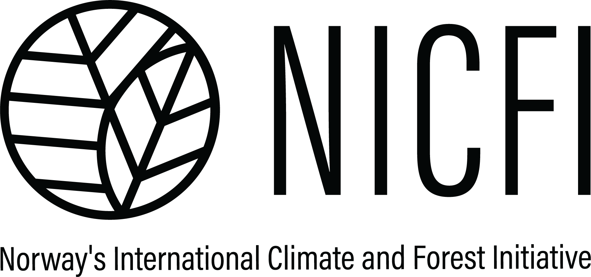

# UNODC

Tree Species AI Classification

This report presents a collaborative initiative developed within the framework of the UNODC's strategic efforts to combat forest crimes. The LEAP Program (Law Enforcement Assistance Programme to Reduce Tropical Deforestation) is a partnership between INTERPOL and several key branches of UNODC, including the Container Control Program (CCP), the Global Program against Money Laundering (GPML), and the Global Maritime Crime Program (GMCP), with support from Norway's International Climate and Forest Initiative (NICFI). 

Through a combination of operational support, investigative training, and interagency cooperation, the program seeks to strengthen the capacities of law enforcement and customs authorities in Latin America and Southeast Asia. The aim is to identify and disrupt illegal timber supply chains, uncover associated financial crimes, and reduce deforestation and biodiversity loss. In Brazil, the program operates across six major ports, and is also active in Colombia and Peru. By promoting cross-sectoral collaboration, LEAP contributes directly to the achievement of the Sustainable Development Goals (SDGs), particularly those related to environmental protection, justice, and institutional effectiveness.

## Technical Meeting 

## Partners 

### **Methodology: Species Selection and Data Acquisition**

#### **1. Species Selection**

The selection of species was guided by two primary criteria: **economic relevance** and **legal protection status**. Priority was given to Amazonian timber species that:

* Have **high commercial value** and are **frequently traded** in local or international markets.
* Are listed as **threatened**, **vulnerable**, or **endangered** under national or international environmental protection frameworks (e.g., IBAMA, CITES).
* Are subject to **specific legislation** regulating extraction, trade, or use.

This approach ensures that the dataset encompasses both **high-risk** and **high-priority** species, making it relevant for enforcement, conservation, and sustainable trade monitoring.

#### **2. Sample Collection**

To ensure data quality and representativeness, the following protocol was used:

* **Specimen selection:** Only **intact wood samples** were used—free from visible signs of decay, pest infestation, or fungal damage.
* **Dimensional criteria:** Samples were required to have **adequate surface area** and **flatness** for consistent spectroscopic imaging and reliable cross-sectional observation.
* **Equipment used:**

  * A **portable digital microscope** was employed to capture high-resolution images of anatomical structures from transverse, radial, and tangential sections.
  * A **portable near-infrared (NIR) spectrometer** was used to collect spectral reflectance data across the appropriate wavelength range for wood identification.

#### **3. Data Acquisition**

* **Imaging procedure:** Cross-sectional images were captured under standardized lighting conditions and magnification levels to highlight species-specific anatomical features.
* **Spectral analysis:** NIR data were acquired for each sample in triplicate to ensure reproducibility. Pre-processing techniques (e.g., baseline correction, normalization) were applied before further analysis.

---

Let me know if you'd like this adapted to a specific style (e.g. for a grant proposal, journal article, or thesis), or if you'd like the next sections written (e.g. preprocessing, model training, or results).

The [repository](repository)

## Bibiography
Carlos Affonso, André Luis Debiaso Rossi, Fábio Henrique Antunes Vieira, André Carlos Ponce de Leon Ferreira de Carvalho.  
**Deep learning for biological image classification**.  
*Expert Systems with Applications*, **Volume 85**, 2017, pp. 114–122.  
ISSN 0957-4174.  
[https://doi.org/10.1016/j.eswa.2017.05.039](https://doi.org/10.1016/j.eswa.2017.05.039)  
avaible at: [ScienceDirect](https://www.sciencedirect.com/science/article/pii/S0957417417303627)

A number of industries use human inspection to visually classify the quality of their products and the raw materials used in the production process, this process could be done automatically through digital image processing. The industries are not always interested in the most accurate technique for a given problem, but most appropriate for the expected results, there must be a balance between accuracy and computational cost. This paper investigates the classification of the quality of wood boards based on their images. For such, it compares the use of deep learning, particularly Convolutional Neural Networks, with the combination of texture-based feature extraction techniques and traditional techniques: Decision tree induction algorithms, Neural Networks, Nearest neighbors and Support vector machines. Reported studies show that Deep Learning techniques applied to image processing tasks have achieved predictive performance superior to traditional classification techniques, mainly in high complex scenarios. One of the reasons pointed out is their embedded feature extraction mechanism. Deep Learning techniques directly identify and extract features, considered by them to be relevant, in a given image dataset. However, empirical results for the image data set have shown that the texture descriptor method proposed, regardless of the strategy employed is very competitive when compared with Convolutional Neural Network for all the performed experiments. The best performance of the texture descriptor method could be caused by the nature of the image dataset. Finally are pointed out some perspectives of futures developments with the application of Active learning and Semi supervised methods.}

https://www.sciencedirect.com/science/article/pii/S0957417417303627
